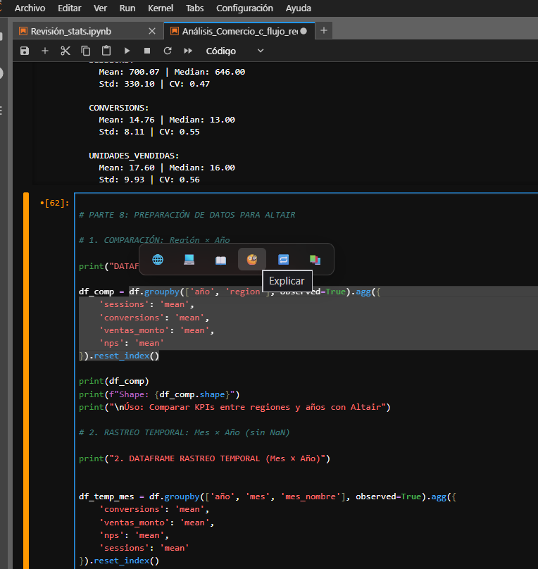
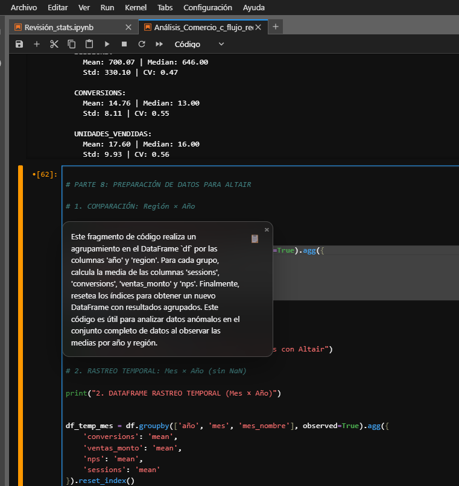
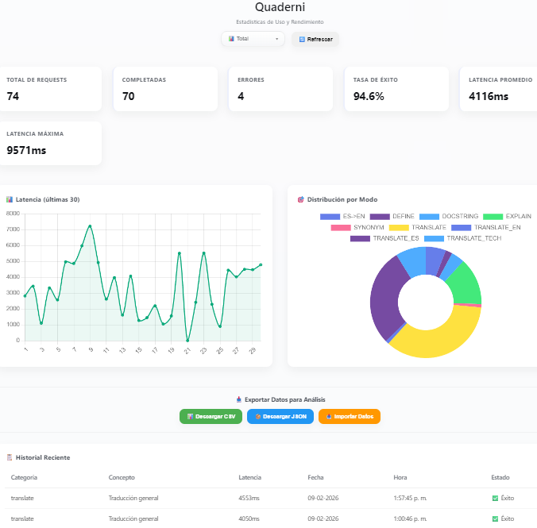

# Quaderni
**Asistente de IA Local para Ciencia de Datos y Desarrollo Python**


Quaderni es una extensión de navegador diseñada para ofrecer asistencia técnica en tiempo real sin depender de conexión a internet ni de APIs externas. Utiliza modelos de lenguaje ejecutados localmente (vía Ollama) para garantizar la privacidad de los datos y un rendimiento ágil con configuraciones modestas.

Especialmente orientada a estudiantes, investigadores y desarrolladores que trabajan con **Python, Jupyter Lab y entornos web de análisis de datos**.

---

## Funcionalidades Principales

Esta herramienta actúa como una capa de asistencia "en la punta del mouse", permitiendo consultar documentación y traducir conceptos técnicos sin salir del contexto de trabajo.

* **Traducción Técnica (EN ↔ ES):** Traduce documentación y comentarios preservando la terminología específica de la industria (no traduce nombres de variables ni funciones).
* **Explicación de Código:** Selecciona un fragmento de código y recibe una explicación lógica paso a paso de su funcionamiento.
* **Generación de Docstrings:** Ayuda a entender la firma de funciones y clases de librerías comunes (Pandas, Numpy, Scikit-learn).
* **Panel de Estadísticas (Dashboard):** Visualiza métricas de uso, tiempos de respuesta y gráficas de rendimiento de las consultas.

---

## Galería de Uso

| Intervención en Contexto (Jupyter) | Traducción y Documentación |
| :---: | :---: |
|  |  |

**Dashboard y Análisis de Rendimiento:**
Visualización en tiempo real de métricas de latencia y éxito de las últimas 20 consultas. El usuario usuario puede analizar sus propios datos, estudiar los tiempos de respuesta de los modelos locales y ajustar sus prompts (instrucciones) para optimizar los resultados según sus objetivos.



---

## Instalación y Configuración

### 1. Motor de IA (Ollama)
1. Descarga Ollama desde [ollama.com](https://ollama.com).
2. Ejecuta en tu terminal:
   ```bash
   ollama pull phi3:mini
    ```

### 2. Instalación de la Extensión
1. Clona este repositorio:
   ```bash
   git clone [https://github.com/CarlosCarriel/quaderni.git](https://github.com/CarlosCarriel/quaderni.git)
    ```
2.  Abre tu navegador (Brave, Chrome, Edge) y ve a `chrome://extensions/`.
3.  Activa el **Modo de desarrollador** (esquina superior derecha).
4.  Haz clic en **Cargar descomprimida** y selecciona la carpeta del proyecto `quaderni`.

### 3. Ejecución
Para asegurar la comunicación entre el navegador y el modelo local, utiliza el script de lanzamiento incluido en la carpeta:

* **En Windows:** Doble clic en `lanzar_quaderni.bat`.
* **En Linux/Mac:** Ejecuta `./lanzar_quaderni.sh`.

> **Nota:** Este script configura los permisos necesarios (CORS) para que la extensión pueda "hablar" con Ollama sin errores de seguridad.

## Ecosistema
Quaderni forma parte de una serie de herramientas diseñadas para la autonomía técnica. Si buscas optimizar tu entorno de trabajo para IA local, te invito a conocer el [**Panóptico**](https://github.com/CarlosCarriel/Panoptico), el complemento ideal para gestionar el rendimiento de estas aplicaciones.

---

## 🤝 Contribuciones y Comunidad

Este proyecto es una iniciativa personal de código abierto (Open Source), compartida bajo licencia **MIT**.

El objetivo es proveer una herramienta útil para la comunidad educativa y profesional sin barreras de entrada. Eres libre de usarla, modificarla y distribuirla. Se agradece cualquier contribución, reporte de errores (Issues) o sugerencias de mejora (Pull Requests) para optimizar el código o añadir nuevas funcionalidades.

---

**Versión**: 1.1.0 (Lotus Edition)  
**Última actualización**: 2026-02-09  
**Autor**: Carlos Carriel Álvarez